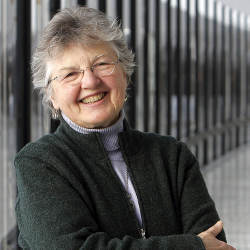

## Frances Elizabeth Allen
**La informática Frances Elizabeth Allen (1932-2020) nació un 4 de agosto. Muere el 4 de agosto de 2020 a los 88 años debido a complicaciones de la enfermedad de Alzheimer .**
## Vida personal
Porque Allen, nacida en Peru, en el estado de Nueva York en 1932 en una familia de granjeros, _**lo que quería era ser profesora.**_ Tras asistir a la escuela y el instituto locales, _**en 1954 se graduó en la Universidad del Estado de Nueva York para profesores con un título en ciencias y matemáticas**_ y comenzó a dar clases en una escuela de su pueblo natal. Una de sus hermanas pequeñas fue su alumna. Después de dos años se matriculó en la Universidad de Michigan y _**obtuvo un título de máster en matemáticas en 1957.**_
## Estudios
**Universidad de Albany (B.S) Universidad de Michigan (M.S)**
## Ocupacion
**Informática teórica, Profesora de universidad y Ingeniera**
## Logros
* Pionera en la optimización de los compiladores (los programas encargados de traducir el código en ceros y unos para que la máquina lo entienda)
* La primera mujer ganadora del Premio Turing, el Nobel de la Informática, en 2006

## Aportaciones y reconocimientos
| Aportaciones  |  Reconocimientos |
| ------------- | :-------------:|
| Entre 1959 y 1963, Frances Allen trabajó en compiladores para los superordenadores IBM 7030 (conocido como Stretch) e IBM 7950 (conocido como Harvest), traduciendo los programas escritos en lenguaje de programación (Fortran, Autocoder, Alpha) a un lenguaje común.    |  En 1989, fue la primera mujer en ser Miembro/Socio de IBM.     |
| Ayudó a desarrollar el software para el proyecto Blue Gene de IBM, un superordenador destinado a explorar cómo se pliegan las proteínas en estructuras tridimensionales     |  En 2006, se le otorga el mayor de los honores, ser la primera mujer en ganar el Premio Turing, el “Nobel de la Informática”.     |
| Pionera en el campo de los compiladores, optimización de código y paralelización.     |  En 2010, es nombrada Académica de las Ciencias de Estados Unidos.     |

## citas

> "Creo que la industria ofrece a las mujeres en el campo de la ciencia, la informática y la ingeniería muchas oportunidades profesionales exitosas y que estas oportunidades aumentarán rápidamente."
>

## Fuentes
Uniersidad de Jaén  [Markdown Live Preview](https://pionerasinformaticas.ujaen.es/es/pioneras-informaticas/frances-elizabeth-allen-es/).
